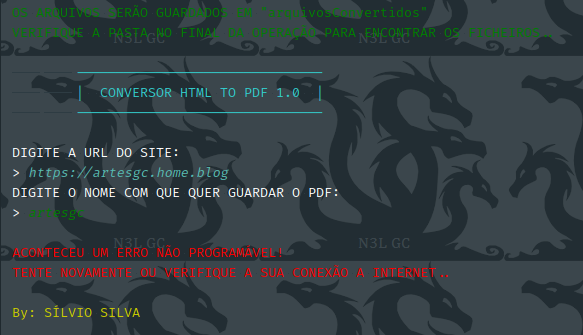
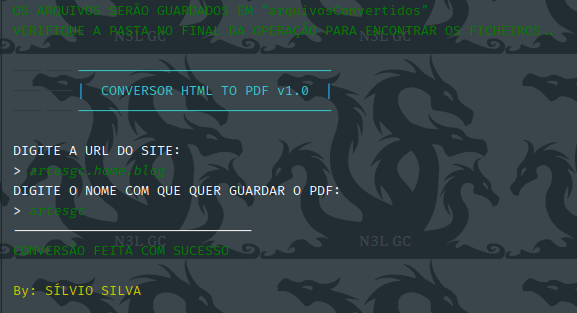

# web_page_to_pdf
**Converta páginas web em PDF de forma simples e eficaz**

    Já precisou guardar uma página web
    no modo off-line para poder ler ou rever depois,
    mas gostaria de ter em formato digital?! 
    
    Este script-programa converte qualquer página web
    em PDF para que você tenha mais liberdade
    na sua leitura ou o que desejar fazer. 

# Dependências 

- pip install -r requirements.txt

# Usando
- python3 __main__.py

# Retornando Erro

# Operação bem sucedida

# Página Convertida - _DEMO_

- [PDF Página exemplar (ArtesGC)](arquivosConvertidos-DEMO/artesgc.pdf)

# Changelog

- [Leia o Arquivo](CHANGELOG)

---

**_Estou dando os primeiros passos na linguagem e a sua opinião ou contributo ajudará imenso, por favor, estrela o repositório e se quiser faça a sua contribuição para ajudar a melhorar este 
script-programa. 🙏🖖❤️_** - [Silvio Silva](https://github.com/silviooosilva)
